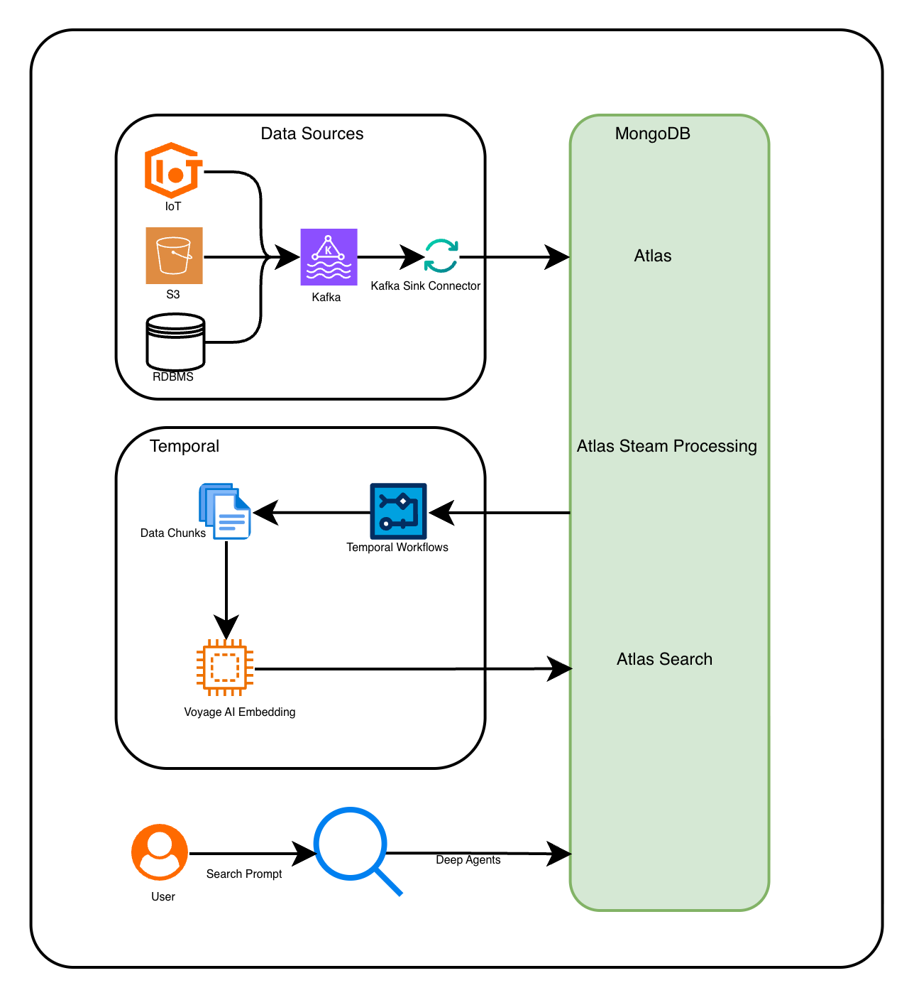

# MongoDB × Temporal — Partner Reference Architecture

A production-grade reference implementation that shows how **Temporal** and **MongoDB Atlas** work
together to build a durable, change-driven RAG pipeline with a deep-agent chat interface.

> **Developers:** see [docs/RUNBOOK.md](docs/RUNBOOK.md) for prerequisites, API key setup,
> local spin-up, and cloud infra references.

---

## What is Temporal?

[Temporal](https://temporal.io) is a **durable execution platform**. It orchestrates long-running
workflows as code — with automatic retries, checkpointing, and resume-on-failure built in. You
write plain Python functions; Temporal ensures they run to completion even across crashes, deploys,
or network partitions.

In this architecture Temporal owns two critical concerns:

| Concern            | What Temporal guarantees                                                                                                                                                                          |
| ------------------ | ------------------------------------------------------------------------------------------------------------------------------------------------------------------------------------------------- |
| Ingestion pipeline | A crash mid-embedding resumes from the last completed chunk — never re-embeds what is already done ([durable execution](https://docs.temporal.io/evaluate/major-advantages#fault-oblivious-code)) |
| Agent workflows    | Multi-step agent plans are durable; a failure mid-conversation resumes without losing tool results or memory writes ([workflows as code](https://docs.temporal.io/workflows))                     |

---

## The problem this solves

Customers hand-roll resilient ingestion/embedding pipelines and it hurts
(source: [MongoDB × Temporal proposal](https://docs.google.com/document/d/1pReiGwWCwFj28nWsZ6NiCA9nWrqhcaWgF51s_odUeCs/edit?tab=t.0#heading=h.54b4x1c9rtcf)):

| Customer     | Pain hand-rolled without Temporal                                        |
| ------------ | ------------------------------------------------------------------------ |
| Regilient AI | MD5 change-tracking in production to decide what to re-embed             |
| Glassdoor    | A homegrown "lambda clock" cron to generate embeddings                   |
| Carrier      | A FastAPI pipeline, hand-tuning sequential vs. parallel                  |
| Emerald X    | A 5-hour import that fails on the last step **reruns the entire import** |

This PRA packages the pattern that removes that pain — already in production at DEA Technology,
100ms, Chess.com, and C.R. England.

---

## Partner Solutions Architecture

### High-level design



**How to read it:**

1. **Data sources** (IoT, S3, RDBMS) feed into **Kafka** via native connectors.
2. A **Kafka Sink Connector** lands raw records into MongoDB Atlas (`sources` collection).
3. **Atlas Stream Processing** watches the change stream on `sources` and triggers the Temporal
   ingest workflow.
4. **Temporal** chunks the content, calls **Voyage AI** for embeddings, and upserts into
   **Atlas Search**.
5. A **Deep Agent** (FastAPI + React) runs vector search over the fresh knowledge and streams
   answers to the user.

> **Serverless option:** Atlas Stream Processing's `$https` invocation pairs naturally with
> [Temporal Serverless Workers on AWS Lambda](https://temporal.io/blog/introducing-temporal-serverless-workers-deploy-temporal-workers-to-aws-lambda)
> — ASP fires the `$https` trigger, Lambda spins up a Temporal worker on demand, and the
> `IngestWorkflow` runs to completion with full durability. No always-on worker process required.

### Division of responsibility

| Concern                                                       | Owner                 |
| ------------------------------------------------------------- | --------------------- |
| Orchestration, retries, checkpointing, backfill, resumability | **Temporal**          |
| Operational data, vector index, agent memory & state          | **MongoDB Atlas**     |
| Embeddings & reranking                                        | **MongoDB Voyage AI** |
| Answer synthesis                                              | **Anthropic Claude**  |

---

## System architecture

```mermaid
flowchart LR

    subgraph SRC["Operational Sources  ·  plug in any Kafka-compatible source"]
        MINIO["MinIO / S3\n(demo — temporal-datasources)"]
        OTHERS["RDBMS · IoT · MongoDB\nKafka topic · ..."]
    end

    subgraph KAFKA_LAYER["Kafka streaming layer"]
        KAFKA[["Kafka\ns3-events topic"]]
        SINK["MongoDB Sink Connector\n(Kafka Connect)"]
        KAFKA --> SINK
    end

    subgraph ATLAS["MongoDB Atlas — single source of truth"]
        SRC_C[("sources")]
        STG[("chunks_staging")]
        KB[("knowledge\n+ vector_index")]
        KB2[("knowledge_v2\n+ vector_index")]
        CFG[("temporal_config\nactive pointer")]
        MEM[("agent_memory")]
    end

    subgraph TRIG["Trigger"]
        ASP["Atlas Stream Processing\n($https)  ·or·  trigger_listener (dev)"]
    end

    subgraph TW["Temporal — IngestWorkflow"]
        S1["1  fetch S3 + factory chunk\n(md / pdf / csv)"]
        S2["2  embed each chunk\n(Voyage AI)"]
        S3["3  create / UPDATE index"]
        S1 --> S2 --> S3
    end

    subgraph BF["Backfill — model upgrade"]
        BFW["BackfillWorkflow\nre-embed → knowledge_v2"]
        CUT["cutover\nflip active pointer"]
    end

    subgraph AGENT["Deep Agent"]
        API["FastAPI /query"]
        UI["React UI\n:5173"]
    end

    MINIO -->|S3 event| KAFKA
    OTHERS -.->|stream events| KAFKA
    SINK -->|upsert by key| SRC_C
    SRC_C -->|change stream| ASP
    ASP -->|start IngestWorkflow| S1
    S1 -->|persist chunks| STG
    STG --> S2
    S3 -->|upsert · prune stale| KB
    KB -.->|read| BFW
    BFW -.->|write| KB2
    KB2 -.-> CUT
    CUT -.-> CFG
    UI --> API
    API -->|read active| CFG
    API -->|vector search + rerank| KB
    API -->|answer + memory| MEM
```



### Atlas data model

```text
Database: temporal
├── sources              ← raw S3 event records (written by Kafka Sink Connector)
├── chunks_staging       ← intermediate chunks during IngestWorkflow
├── knowledge            ← embedded docs + Atlas Vector Search index (active)
├── knowledge_v2         ← BackfillWorkflow writes here on model upgrade (blue/green)
├── temporal_config      ← active collection/index pointer (flipped by cutover)
└── agent_memory         ← agent state, memory, citations (written by Deep Agent)
```

The agent **writes memory back into the same database the retrieval reads from** — no copy, no lag.

---

## Quickstart (local demo)

```bash
# 1. Clone and enter the repo
git clone https://github.com/suresharam/mongodb-temporal-sa-pra.git
cd mongodb-temporal-sa-pra

# 2. Copy and fill in credentials
cp .env.example .env
# Edit .env: set MONGODB_URI, VOYAGE_API_KEY, ANTHROPIC_API_KEY

# 3. Install all dependencies (Python + UI)
make setup

# 4. Start everything (Kafka, Connect, MinIO, Temporal, worker, agent API + UI)
make start

# 5. Create the Atlas Vector Search index (one-time)
make index

# 6. Seed a sample document to trigger the full pipeline
make seed

# 7. Open the agent UI
open http://localhost:5173

# 8. Tear everything down
make stop
```

`make help` lists all available targets.

| Service           | URL                   | Login                                          |
| ----------------- | --------------------- | ---------------------------------------------- |
| Agent chat UI     | http://localhost:5173 |                                                |
| Temporal Web UI   | http://localhost:8233 |                                                |
| Agent API         | http://localhost:8090 |                                                |
| MinIO console     | http://localhost:9001 | username: `minioadmin`, password: `minioadmin` |
| Kafka Connect API | http://localhost:8083 |                                                |

---

## Repo layout

```text
mongodb-temporal-sa-pra/
├── README.md
├── Makefile                        ← all dev commands (make help)
├── pyproject.toml                  ← Python deps managed by uv
├── .env.example                    ← copy → .env, fill credentials
├── agent/
│   ├── api.py                      ← FastAPI deep-agent backend (:8090)
│   ├── retrieval.py                ← vector search + rerank + Claude answer
│   └── ui/                         ← React/Vite chat UI (:5173)
├── pipeline/
│   ├── worker.py                   ← Temporal worker process
│   ├── trigger_listener.py         ← local change-stream trigger shim (dev)
│   ├── trigger_api.py              ← ASP $https trigger endpoint (production)
│   ├── workflows/
│   │   ├── ingest_workflow.py      ← IngestWorkflow: fetch → chunk → embed → index
│   │   └── backfill_workflow.py    ← BackfillWorkflow: re-embed → knowledge_v2
│   ├── activities/
│   │   ├── ingest.py               ← fetch + stage + embed + index activities
│   │   └── backfill.py             ← re-embed activity
│   ├── extractors/                 ← md / pdf / csv / text extractors
│   ├── config_store.py             ← active collection/index pointer
│   └── search_index.py             ← idempotent Atlas Vector Search management
└── infra/
    ├── docker-compose.yml          ← Kafka + Connect + MinIO (local dev)
    ├── connectors/mongo-sink.json  ← Kafka Connect → temporal.sources
    ├── atlas_indexes.json          ← Vector Search index definitions
    └── asp/README.md               ← Atlas Stream Processing setup (production)
```

---

## Developer guide

Follow **[docs/RUNBOOK.md](docs/RUNBOOK.md)** for setup instructions
