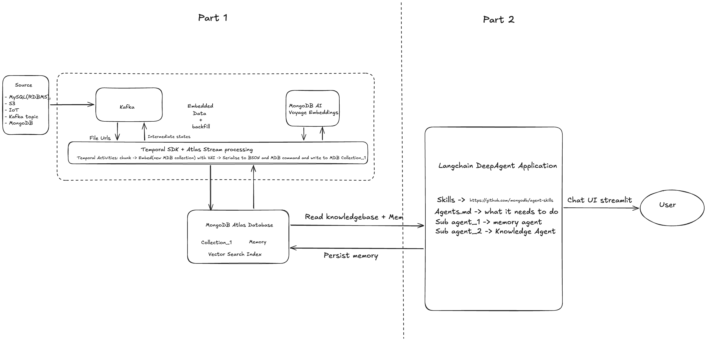
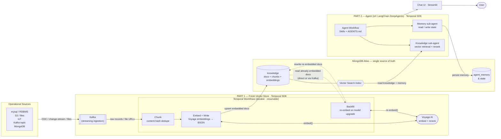
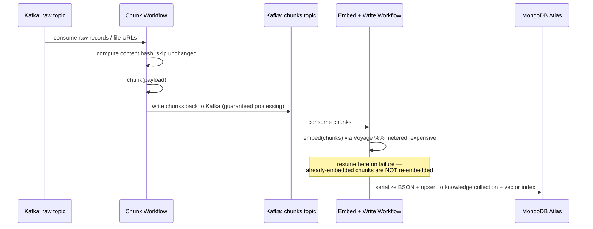
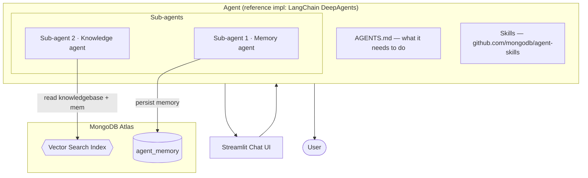

# MongoDB × Temporal — Partner Reference Architecture (PRA)

This README aligns with the [proposal](https://docs.google.com/document/d/1pReiGwWCwFj28nWsZ6NiCA9nWrqhcaWgF51s_odUeCs/edit?tab=t.0#heading=h.54b4x1c9rtcf) and formalizes it into a
clean, buildable architecture in **two parts**:

- **Part 1 — The fresh vector store.** A Temporal-orchestrated, change-driven pipeline that lands
  operational data into Atlas and embeds it with Voyage — durably and resumably.
- **Part 2 — The agent that uses it.** A framework-neutral agent that runs vector retrieval over
  the fresh data **and writes memory back to the same database** — no copy, no lag.

---

## Table of contents

- [Why this architecture](#why-this-architecture)
- [System overview](#system-overview)
- [Part 1 — The fresh vector store](#part-1--the-fresh-vector-store)
  - [Data sources & connector priority](#data-sources--connector-priority)
  - [Temporal workflows & activities](#temporal-workflows--activities)
  - [The four durability guarantees](#the-four-durability-guarantees)
  - [MongoDB Atlas data model](#mongodb-atlas-data-model)
- [Part 2 — The agent that uses it](#part-2--the-agent-that-uses-it)
- [How the sketch maps to this design](#how-the-sketch-maps-to-this-design)
- [Scope & non-goals](#scope--non-goals)
- [Repo layout](#repo-layout)
- [Milestones](#milestones)

---

## Why this architecture

Customers hand-roll the resilient ingestion/embedding pipeline and it hurts. From the proposal:

| Customer     | Pain they hand-rolled                                                    |
| ------------ | ------------------------------------------------------------------------ |
| Regilient AI | MD5 change-tracking in production to decide what to re-embed             |
| Glassdoor    | A homegrown "lambda clock" cron to generate embeddings                   |
| Carrier      | A FastAPI pipeline, hand-tuning sequential vs. parallel                  |
| Emerald X    | A 5-hour import that fails on the last step **reruns the entire import** |

The pattern that removes this pain is already in production at DEA Technology, 100ms, Chess.com,
and C.R. England (who chose Temporal for agent state because it "handles it a lot better than
LangGraph natively"). This PRA packages that pattern so any team can fork it.

**The division of responsibility is the whole point:**

| Concern                                                       | Owner             |
| ------------------------------------------------------------- | ----------------- |
| Orchestration, retries, checkpointing, backfill, resumability | **Temporal**      |
| Operational data, vector index, agent memory & state          | **MongoDB Atlas** |
| Embeddings & reranking                                        | **Voyage AI**     |

---

## System overview

The original hand-drawn architecture sketch (source of truth for this design):



Refined into the buildable architecture below:



**How to read it (left → right):**

1. **Sources** feed a **Kafka** streaming layer inside Part 1.
2. **Part 1 (Temporal SDK)** chunks, embeds with **Voyage**, serializes to BSON, and **writes to
   Atlas** — durably and resumably (a crash resumes without re-embedding finished chunks).
3. **MongoDB Atlas** is the single store: `knowledge` + `vector_index` for retrieval and
   `agent_memory` for state — the read side and write side share one database.
4. **Part 2** agent reads the fresh knowledge for retrieval and **writes memory back** to the same
   Atlas, streaming answers to the **User** via Streamlit.

The **backfill** loop (dashed) is intentionally _not_ a re-ingestion from source: on a model
upgrade (e.g. Voyage 3 → 4) the `BackfillWorkflow` **reads the already-embedded documents from
Atlas** (directly or re-streamed through Kafka), **re-embeds** them, and **rewrites them back to
Atlas** — no source replay, no lost progress.

---

## Part 1 — The fresh vector store

A Temporal-orchestrated pipeline that moves data from operational sources into Atlas and embeds it
with Voyage. It demonstrates Temporal's **durable execution** while staying a _generic_ reference
(MongoDB auto-embedding is noted as an alternative to the explicit Voyage Embedding/Reranking API).

### Data sources → Kafka → Temporal

The flow (matching the sketch) is: **all sources feed into a Kafka streaming layer, then Temporal
consumes from Kafka** to chunk, embed, and store into Atlas.

```
mysql (RDBMS) ┐
S3            │
IoT           ├──▶  Kafka (streaming ingestion)  ──▶  Temporal Ingest Workflow  ──▶  Atlas
Kafka topic   │
MongoDB       ┘
```

**Why Kafka sits inside Part 1:** Kafka is everywhere in the target accounts (SoFi has a live
Kafka→Mongo vector need; also TSYS, US LBM, Schneider). It is part of the pipeline, used in **two
places**:

1. A **raw topic** that all sources feed into — Temporal's Chunk Workflow consumes it.
2. A **chunks topic** that the Chunk Workflow **writes chunks back to** — so every chunk is durably
   queued and **guaranteed to be processed** by the Embed + Write Workflow, even across restarts.

Temporal owns everything: consume raw → chunk → write chunks back to Kafka → consume chunks → embed
→ serialize → write to Atlas.

**Connector priority (proposal):**

1. **Kafka first** — the demo's primary streaming source. Part 1 connects to Kafka first.
2. **CDC / Debezium second** — off SQL Server and Oracle, produced _onto Kafka topics_ (Jack Henry
   explicitly wants us to own the Debezium complexity).
3. **Snowflake later.**

> **Aligned with sketch:** sources → **Kafka raw topic** → **Temporal chunks** → **chunks written
> back to Kafka** → **Temporal embeds + stores to Atlas**. Kafka lives inside Part 1. Incremental
> sync is achieved by CDC/Change-Stream events arriving as Kafka records plus content-hash dedupe in
> the Chunk Workflow.

### Temporal workflows & activities

The sketch's activity bar becomes named workflows built from small, **idempotent, checkpointed
Temporal SDK activities**, with Kafka used as a durable hand-off between chunking and embedding:



**Workflows**

- **`ChunkWorkflow`** — **consumes the raw Kafka topic** (records may originate from RDBMS, S3, IoT,
  MongoDB, or CDC/Debezium). Applies content-hash dedupe, chunks the payload, and **writes chunks
  back to a Kafka `chunks` topic**. This decouples the cheap chunking step from the expensive
  embedding step and guarantees every chunk is processed even across restarts.
- **`EmbedWriteWorkflow`** — **consumes the `chunks` topic**, embeds each chunk via Voyage,
  serializes to BSON, and upserts to the Atlas knowledge collection + vector index. Emits
  `Intermediate states` as workflow history so a crash resumes without re-embedding done chunks.
- **`BackfillWorkflow`** — a **first-class** workflow triggered by a model-version change (e.g.
  **Voyage 3 → 4**, which changes vector dimensions). It **reads the existing documents already in
  Atlas, re-embeds them, and rewrites them back to Atlas** — no re-ingestion from source, no lost
  progress.

### The four durability guarantees

These are the proposal's headline value props. The design makes each one explicit:

| #   | Guarantee                            | How it's implemented                                                                                                                                                                                                                                           |
| --- | ------------------------------------ | -------------------------------------------------------------------------------------------------------------------------------------------------------------------------------------------------------------------------------------------------------------- |
| 1   | **Multiple sources**                 | All sources (RDBMS, S3, IoT, Kafka topic, MongoDB, CDC) feed the **Kafka raw topic**; `ChunkWorkflow` consumes it — all land in MongoDB.                                                                                                                       |
| 2   | **Incremental, change-driven sync**  | CDC/Change-Stream records on Kafka + content-hash dedupe → only what changed is reprocessed (replaces Regilient's hand-rolled MD5, Glassdoor's cron).                                                                                                          |
| 3   | **Durable, resumable execution**     | Chunks are **written back to a Kafka `chunks` topic** and workflow history checkpoints each activity. A failure at hour 4 resumes from the last step and **does not re-embed** the 3 hours already done — embedding is metered (fixes Emerald X's full-rerun). |
| 4   | **Backfill as first-class workflow** | `BackfillWorkflow` **reads existing Atlas data, re-embeds, and rewrites to Atlas** for dimension-changing model upgrades (Voyage 3→4) — durable, progress preserved.                                                                                           |

### MongoDB Atlas data model

```
Atlas Database: pra
├── knowledge            # source docs + chunks + Voyage embeddings (BSON)
│     └── vector_index   # Atlas Vector Search index over `embedding`
├── knowledge_v2         # BackfillWorkflow reads `knowledge`, re-embeds, rewrites here (blue/green)
└── agent_memory         # Part 2 writes here: memory, intermediate results, learned prefs
```

Key property from the proposal: **the agent writes back into the same database the retrieval reads
from** — `agent_memory` lives beside `knowledge`. _No copy, no lag._

---

## Part 2 — The agent that uses it

A **framework-neutral** agent runs vector search and retrieval over the fresh data. Temporal
orchestrates the multi-step agent; MongoDB persists its state and memory. Critically, the agent
**does not only read — it writes back**: memory, intermediate results, and learned preferences land
in the same DB the retrieval reads from.

The sketch's **LangChain DeepAgents** application is kept as the **reference implementation**, but
behind a neutral boundary so the repo can swap frameworks (the proposal explicitly calls for a
framework-neutral agent; the agent framework is "to be named").



- **Knowledge sub-agent** → runs Atlas Vector Search (+ optional Voyage reranking) over `knowledge`.
- **Memory sub-agent** → reads/writes `agent_memory` (durable across turns, orchestrated by Temporal).
- **Skills / AGENTS.md** → declarative capabilities (from `github.com/mongodb/agent-skills`).
- **Chat UI** → Streamlit, streaming responses to the User.

> **Why Temporal here too:** C.R. England chose Temporal for agent state because it "handles it a
> lot better than LangGraph natively." The agent's multi-step plan is a durable workflow, so a
> mid-conversation failure resumes without losing tool results or memory writes.

---

## How the sketch maps to this design

| Sketch element                                      | Aligned design                                                      | Change / rationale                                      |
| --------------------------------------------------- | ------------------------------------------------------------------- | ------------------------------------------------------- |
| Source: mysql, S3, IoT, Kafka topic, MongoDB        | Same sources, all **feeding into Kafka** streaming layer            | Matches sketch: sources funnel through Kafka            |
| Kafka box                                           | Moved **inside Part 1**; two topics — raw + chunks                  | Chunks written back to Kafka for guaranteed processing  |
| "Temporal SDK + Atlas Stream Processing" bar        | `ChunkWorkflow` + `EmbedWriteWorkflow` (Temporal SDK)               | Makes durability/resume explicit                        |
| `chunk → Embed(VAI) → BSON → write Collection_1`    | Chunk → **Kafka chunks topic** → embed → BSON → write, checkpointed | Adds Kafka hand-off + content-hash dedupe (no re-embed) |
| "Intermediate states" label                         | Temporal **workflow history**                                       | This _is_ the resumability guarantee                    |
| "Embedded Data + backfill"                          | `BackfillWorkflow` **reads Atlas → re-embed → rewrite Atlas**       | Backfill re-embeds existing Atlas data, not source      |
| MongoDB AI / Voyage Embeddings                      | Voyage Embedding + Reranking API                                    | Note MongoDB auto-embedding as alternative              |
| Atlas DB: Collection_1, Memory, Vector Search Index | `knowledge`, `agent_memory`, `vector_index`                         | Same DB for read + write — no copy, no lag              |
| LangChain DeepAgent Application                     | Reference impl behind **framework-neutral** boundary                | Proposal mandates framework neutrality                  |
| Sub agent_1 memory / Sub agent_2 knowledge          | Memory sub-agent / Knowledge sub-agent                              | Unchanged                                               |
| Chat UI Streamlit → User                            | Unchanged                                                           | —                                                       |

---

## Scope & non-goals

**In scope**

- **Part 1:** Kafka + API source, Change-Stream/CDC incremental sync, Voyage embedding,
  resume-without-re-embed, model-version backfill.
- **Part 2:** framework-neutral agent, vector retrieval, agent state in MongoDB under Temporal.
- Shipped as a **public, forkable repo** + live demo.

**Non-goals** (explicit in the proposal)

- A connector framework.
- MongoDB as self-hosted Temporal persistence.
- MongoDB as a Temporal visibility / search augmentation.

---

## Repo layout

```
temporal-pra/
├── README.md                  # this file
├── pipeline/
│   ├── workflows/
│   │   ├── chunk_workflow.py       # consume raw topic -> chunk -> write chunks topic
│   │   ├── embed_write_workflow.py # consume chunks topic -> embed -> write Atlas
│   │   └── backfill_workflow.py    # read Atlas -> re-embed -> rewrite Atlas
│   ├── activities/
│   │   ├── chunk.py
│   │   ├── embed_voyage.py         # metered; idempotent
│   │   └── write_atlas.py          # BSON serialize + upsert
│   ├── kafka/
│   │   ├── raw_topic.py            # all sources -> raw topic
│   │   ├── chunks_topic.py         # chunks written back for guaranteed processing
│   │   ├── cdc_debezium.py         # CDC producers onto Kafka topics
│   │   └── producers.py            # RDBMS/S3/IoT/MongoDB -> Kafka
│   └── worker.py                   # Temporal SDK worker
├── agent/
│   ├── agent.py                    # framework-neutral entrypoint
│   ├── deepagents_impl/            # reference impl (LangChain DeepAgents)
│   │   ├── AGENTS.md
│   │   ├── memory_agent.py
│   │   └── knowledge_agent.py
│   ├── retrieval.py                # Atlas Vector Search + Voyage rerank
│   └── ui_streamlit.py
└── infra/
    ├── atlas_indexes.json          # vector search index definitions
    └── docker-compose.yml          # Temporal + Kafka + worker (local)
```

---

## Milestones

| Date             | Deliverable                    |
| ---------------- | ------------------------------ |
| **Jul 21, 2026** | Initial Design (this document) |
| **Jul 28, 2026** | Draft Implementation           |
| **Aug 3, 2026**  | Review                         |
| **Aug 10, 2026** | Complete demo                  |
| **Aug 13, 2026** | `.Local` SF event              |

**Resourcing:** Suresh Ramappa (MongoDB co-builder), Cornelia (Temporal point), Benjamin Flast &
Tasha Loven (MongoDB technical). Architecture input from AEs on live accounts (Abbie Wolfe, Peter W
Harris). Optional design partner: DEA Technology, 100ms, C.R. England, or SoFi (live Kafka→Mongo need).
