# Runbook — Connector ingress → Temporal ingest → deep-agent UI

End-to-end flow:

> **Upload to S3 → Kafka → MongoDB Sink Connector → `sources` → (Atlas Stream
> Processing / trigger) → Temporal `IngestWorkflow` (fetch + factory-chunk → embed → index)
> → Atlas Search.** A deep agent (FastAPI + React) queries it.

## Quickstart (Makefile)

Self-contained demo (MinIO stands in for S3; no AWS). `make help` lists all targets.

```bash
cp .env.example .env       # fill MONGODB_URI, VOYAGE_API_KEY, ANTHROPIC_API_KEY
make start                 # deps + infra (Kafka+Connect+MinIO, sink connector) + Temporal + worker + trigger-listener + agent-api
make seed                  # upload a sample file -> ingested automatically
make agent-ui              # React UI at http://localhost:5173
make stop                  # tear everything down
```

`make seed FILE=./doc.pdf KEY=docs/doc.pdf` ingests your own file (md / pdf / csv / text).
The Atlas Vector Search index is created automatically by the workflow; `make index` can
pre-create it. `make start` reuses an existing Temporal on :7233 and backgrounds processes
to `.local/*.log` (`make app-logs`).

## Architecture (current setup)

```mermaid
flowchart LR
    USER([User / file upload])

    subgraph SYNC["Auto data sync — managed connectors"]
        direction TB
        MINIO["MinIO / S3<br/>(temporal-datasources)"]
        KAFKA[["Kafka topic<br/>s3-events"]]
        SINK["MongoDB Sink Connector<br/>(Kafka Connect)"]
        MINIO -->|native S3 event| KAFKA
        KAFKA --> SINK
    end

    subgraph ATLAS["MongoDB Atlas"]
        direction TB
        SRC[("sources")]
        STG[("chunks_staging")]
        KB[("knowledge (+ vector_index)")]
        KB2[("knowledge_v2 (+ vector_index)")]
        CFG[("temporal_config · active pointer")]
        MEM[("agent_memory")]
    end

    SINK -->|upsert by S3 key| SRC

    subgraph TRIG["Trigger"]
        ASP["Atlas Stream Processing<br/>($https)  ·or·  trigger_listener (dev)"]
    end
    SRC -->|change stream| ASP

    subgraph TW["Temporal — IngestWorkflow"]
        direction TB
        S1["1 fetch S3 + factory chunk<br/>(md / pdf / csv)"]
        S2["2 embed each chunk (Voyage)"]
        S3["3 create / UPDATE index"]
        S1 --> S2 --> S3
    end
    ASP -->|start IngestWorkflow| S1
    S1 -->|persist chunks| STG
    STG --> S2
    S3 -->|upsert · prune stale| KB

    subgraph BF["Backfill on model change"]
        BFW["BackfillWorkflow<br/>re-embed -> knowledge_v2"]
        CUT["cutover.py<br/>flip active pointer"]
    end
    KB -.->|read| BFW
    BFW -.->|write| KB2
    KB2 -.-> CUT
    CUT -.-> CFG

    subgraph AGENT["Deep agent"]
        API["FastAPI /query"]
        UI["React UI"]
    end
    UI --> API
    API -->|read active| CFG
    API -->|vector search + rerank| KB
    API -->|answer + memory| MEM
    USER --> UI
    USER -->|upload| MINIO
```



## Prerequisites

- `uv` (repo pins CPython 3.12), Docker, and the `temporal` CLI.
- MongoDB Atlas cluster (`MONGODB_URI`), Voyage key (`VOYAGE_API_KEY`), Anthropic key
  (`ANTHROPIC_API_KEY`, for RAG answers — retrieval works without it).
- Atlas must allow connections from this machine **and** from the Kafka Connect container
  (same NAT public IP) so the sink can write `sources`.

## Components

| Piece              | Where                                                                                        | Role                                             |
| ------------------ | -------------------------------------------------------------------------------------------- | ------------------------------------------------ |
| S3 listener        | MinIO native Kafka notify                                                                    | file upload → `s3-events` topic                  |
| Sink connector     | `infra/connectors/mongo-sink.json` (registered by `infra/register_connector.py`)             | `s3-events` → `temporal.sources` (upsert by key) |
| Trigger            | `pipeline/trigger_api.py` (ASP `$https`) / `pipeline/trigger_listener.py` (dev)              | `sources` change → start `IngestWorkflow`        |
| IngestWorkflow     | `pipeline/workflows/ingest_workflow.py`                                                      | fetch → factory chunk → embed → index            |
| Extractor factory  | `pipeline/extractors/`                                                                       | md / pdf / csv / text                            |
| Backfill + cutover | `pipeline/workflows/backfill_workflow.py`, `pipeline/cutover.py`, `pipeline/config_store.py` | re-embed → `knowledge_v2` → flip active pointer  |
| Deep agent         | `agent/api.py`, `agent/retrieval.py`, `agent/ui/`                                            | vector search → rerank → Claude answer + memory  |

## Verify ingestion

```bash
make connector-status          # sink connector should be RUNNING
make seed FILE=./thing.pdf KEY=docs/thing.pdf
# watch Temporal UI (http://localhost:8233): IngestWorkflow Completed
make query Q="something in that file"
```

Confirm `temporal.sources` got a doc (sink) and `knowledge` got embedded chunks.

## Update-in-place (re-upload)

Re-upload the same key with edited content → the sink replaces the `sources` doc →
`IngestWorkflow` re-runs and **updates** the doc's chunks (upsert by `chunk_id`, stale
ordinals pruned), no duplicates.

## Backfill + cutover (embedding-model change)

```bash
make backfill MODEL=voyage-3-large            # re-embed active collection -> knowledge_v2 (+ new index)
# wait for BackfillWorkflow Completed and the knowledge_v2 index to be READY
make cutover TO=knowledge_v2                  # flip temporal_config active pointer (blue/green)
make query Q="…"                              # now served from knowledge_v2 / voyage-3-large
```

## Deep agent + UI

```bash
make agent-api      # FastAPI on :8090  (POST /query, GET /health)
make agent-ui       # React (Vite) on :5173, proxies /query to the API
```

The UI shows the synthesized answer (with citations) plus ranked source chunks; each query
is written to `agent_memory`.

## Production trigger (Atlas Stream Processing)

`trigger_listener.py` is the local shim. In production, ASP watches `sources` and
`$https`-POSTs to `trigger_api.py` (`/ingest-trigger`). See `infra/asp/README.md`.
