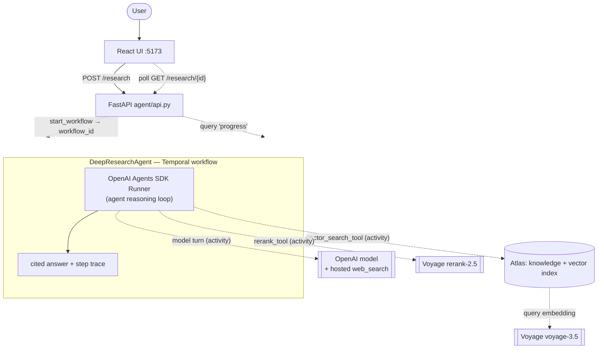

# Agent — durable research agent

The agent is a **durable research agent** built with the **OpenAI Agents SDK**, whose reasoning
loop runs **as a Temporal workflow** (`DeepResearchAgent`) via the Temporal ↔ OpenAI Agents SDK
integration (`temporalio.contrib.openai_agents`). Model calls and tool calls execute as Temporal
activities, so the entire trajectory is durable, resumable, and inspectable in the Temporal UI.
Code: `agent/agent_workflow.py`, `agent/tools.py`, `agent/api.py`, `agent/ui/`.

## Query flow

Solid arrows are the request path and the agent loop; dotted arrows are the external call each
step makes.

## Systems used

| System            | Role                                                                    |
| ----------------- | ----------------------------------------------------------------------- |
| **Temporal**      | Runs the agent loop as a durable workflow; model + tool calls are activities |
| **OpenAI Agents SDK** | The agent framework (tool selection, loop); model = `AGENT_MODEL`   |
| **MongoDB Atlas** | Vector store (`knowledge`) queried by the `vector_search` tool          |
| **Voyage AI**     | Query **embedding** (`voyage-3.5`) + **rerank** (`rerank-2.5`) inside the tools |
| **FastAPI**       | `POST /research` (start) + `GET /research/{id}` (poll) on `:8090`        |
| **React + Vite**  | Chat UI on `:5173`; polls progress and renders the live step feed       |

## How it works

`DeepResearchAgent.run(query)` (`agent/agent_workflow.py`) builds an `Agent` and runs
`Runner.run(agent, query, hooks=…)`. The agent decides which tools to call and how often:

1. **Tools (as activities).** `vector_search_tool` and `rerank_tool` (`agent/tools.py`) are
   Temporal activities exposed to the agent via `activity_as_tool`:
   - `vector_search_tool(query, k)` — Voyage-embeds the query and `$vectorSearch`es the active
     `knowledge` collection; returns candidate chunks (`chunk_id`, `source_uri`, `text`, `score`).
   - `rerank_tool(query, chunk_ids, top_k)` — reloads those chunks' text **server-side** by id
     and reranks with Voyage `rerank-2.5`, so the model never shuttles chunk text through tool
     arguments.
   - A hosted **`WebSearchTool`** supplements the corpus; being hosted, it runs *inside* the
     model-call activity (OpenAI Responses API), not as a separate Temporal activity.
2. **Instructions.** Decompose multi-part questions and search each sub-topic separately; rerank
   the collected candidates; prefer the ingested docs over the open web; answer only from
   gathered sources with inline `[n]` citations.
3. **Answer.** The agent model writes the final cited answer itself — there is no separate
   synthesis step.

## Live progress (no token streaming)

Because the loop is a workflow, progress can be surfaced without streaming tokens:

- A `_ProgressHooks(RunHooks)` appends human-readable steps ("Searching the docs…",
  "Reranking…", "Reasoning…") to workflow state as tools/model turns fire.
- A `@workflow.query def progress()` exposes `{steps, tool_calls, answer, done}` — read-only,
  safe to poll, replay-safe (steps rebuild from recorded activity results).
- `POST /research` starts the workflow and returns a `workflow_id`; the UI polls
  `GET /research/{id}` (~600 ms) and renders the live step list, then the answer when `done`.

## How it ties to the vector store

- **Shared retrieval.** `vector_search_tool` wraps `pipeline.retrieval.vector_search` — the same
  retrieval code the ingestion side's tests exercise; "search Atlas" is defined once.
- **Cut-over aware.** Retrieval reads the active collection/model/index from `temporal_config`
  on every call, and embeds the query with the **active** model — so a blue/green model upgrade
  (`make backfill` → `make cutover`) is transparent, with query and document vectors always in
  the same space.
- **Same database.** The agent reads the exact `knowledge` collection the ingestion pipeline
  wrote — no copy, no lag.

## Durability & observability

- **Resumable:** if the worker crashes mid-run, Temporal resumes the agent loop instead of
  restarting it.
- **Auditable:** every model call and `vector_search`/`rerank` tool call is a workflow-history
  event — the trajectory is replayable in the Temporal UI (the hosted web search folds into the
  model activity rather than appearing as its own event).
- **Opt-in:** the agent and its `OpenAIAgentsPlugin` load only when `OPENAI_API_KEY` is set;
  without it the worker runs ingestion exactly as before and `/research` returns a clear 503.

## Notes / current limitations

- **Web search is a hosted tool** — it runs inside the model-call activity and requires a
  web-search-capable OpenAI model (`AGENT_MODEL`). It surfaces as a "Reasoning…" step, not a
  distinct "Searching the web…" step. A custom SERP tool wrapped as an activity would make it a
  first-class, individually-auditable step.
- **No token streaming** — progress is step-level via query polling, not token-by-token.
- **Agent memory is not written yet** — the agent doesn't read/write long-term memory in its
  loop. Atlas remains the intended store for it (same database as retrieval); wiring it in is a
  follow-up.
