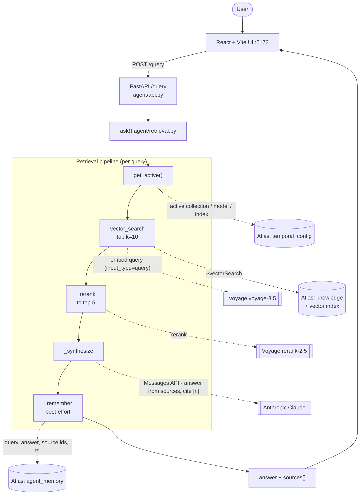

# Agent — retrieval & synthesis

The "deep agent" is a compact retrieval-augmented-generation (RAG) endpoint with a memory
write. The whole agent is the `ask()` function in `agent/retrieval.py`; `agent/api.py` exposes
it over HTTP and the React/Vite UI (`agent/ui/`) calls it.

## Query flow

Solid arrows are the request path and the ordered pipeline steps; dotted arrows are the
external call each step makes.

## Systems used

| System            | Role                                                        |
| ----------------- | ----------------------------------------------------------- |
| **FastAPI**       | Backend; `POST /query` + `/health` on `:8090` (`agent/api.py`) |
| **React + Vite**  | Chat UI on `:5173` (`agent/ui/src/`)                        |
| **MongoDB Atlas** | Vector store (`knowledge`), memory (`agent_memory`), active pointer (`temporal_config`) |
| **Voyage AI**     | Query **embedding** (`voyage-3.5`) and **rerank** (`rerank-2.5`) |
| **Anthropic Claude** | Answer **synthesis** (`settings.answer_model`)           |

## How it works

`ask(query, k=10, top_k=5)` (`agent/retrieval.py`) runs a linear pipeline:

1. **Resolve the active target** — `get_active()` reads `temporal_config` for the live
   collection, index, and embedding model (cut-over-aware).
2. **Vector search** — `vector_search` (`pipeline/retrieval.py`) embeds the query with Voyage
   (`input_type="query"`) and runs Atlas `$vectorSearch` on the active `knowledge` collection
   (`numCandidates = max(100, k*20)`, `limit = k`). Returns the top `k` chunks with
   `vectorSearchScore`.
3. **Rerank** — `_rerank` reorders those `k` hits down to `top_k` via Voyage `rerank-2.5`
   (over-retrieve then rerank).
4. **Synthesize** — `_synthesize` makes one Anthropic Messages API call (non-streaming,
   `max_tokens=1024`). System prompt: *answer ONLY from the provided sources, cite inline as
   `[n]`*. User message = the question + the numbered chunks.
5. **Remember** — `_remember` inserts the query, answer, source `chunk_id`s, model, and
   timestamp into `agent_memory` (best-effort).

The response carries `answer`, `answer_available`, the serving `active_collection` / `model`,
and `sources[]` (each with `s3_uri`, `chunk_id`, rerank + vector scores, and a 600-char
snippet).

## How it is tied to the vector store

- **Shared retrieval.** The agent reuses the pipeline's `vector_search` — one definition, not a
  copy.
- **Cut-over aware, no restart.** Every query calls `get_active()`, so a blue/green model
  upgrade (`make backfill` → `make cutover`) flips the agent to `knowledge_v2` and its index
  transparently. The query is embedded with the **active model** (not hard-coded), so after a
  cutover to a new embedding model, queries automatically match the collection's model/dims.
- **Same database in and out.** Retrieval reads Atlas; memory writes back to Atlas — no copy,
  no lag.
- **Self-healing indexes.** On startup (`agent/api.py`) the backend ensures the collections and
  the Atlas Vector Search index exist before serving.

## Notes / current limitations

- **Not agentic in the tool-using sense.** There is no planning loop, tool use, or multi-step
  reasoning — it is a single retrieve → rerank → synthesize → log pass.
- **Memory is write-only.** `_remember` records every Q&A into `agent_memory`, but nothing
  reads it back into retrieval or answering. Today it is an audit log of interactions, not a
  memory that influences future answers.
- **Graceful degradation.** If rerank fails, it falls back to vector order; if the Anthropic key
  is missing/placeholder, it returns ranked sources with `answer: null`. Retrieval works with
  zero LLM cost — only synthesis needs Claude.
- **No streaming.** Synthesis is a single `messages.create` call returning one JSON response
  (not server-sent streaming).
- **Proxy/Azure-aware Claude client.** `_synthesize` supports `anthropic_base_url` +
  subscription-key headers, so it can front an Azure-hosted or gateway'd Claude.
